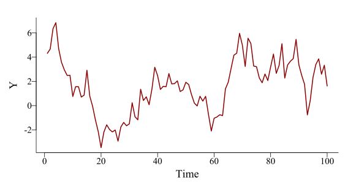
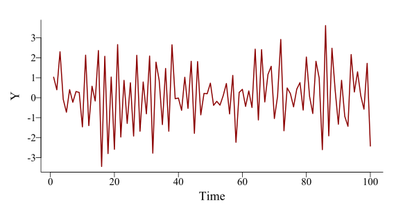

class: middle center
```{r setup, include=FALSE, cache=FALSE}
options(htmltools.dir.version = FALSE)
knitr::opts_chunk$set(cache = FALSE, dev = 'svg', echo = TRUE,
                      message = FALSE, warning = FALSE,
                      fig.align = 'center',
                      fig.height = 5.1, fig.width = 1.9 * 5.1)
library('mgcv')
library('mvgam')
library('forecast')
library('gamair')
library('ggplot2')
library('viridis')
library('fontawesome')
library('gratia')
library('ggborderline')
library('kableExtra')
theme_set(theme_bw(base_size = 12, base_family = 'serif'))
options(ggplot2.discrete.colour = c("#B97C7C",
                              "#A25050",
                              "#8F2727",
                              "#630000"),
        ggplot2.discrete.fill = c("#B97C7C",
                            "#A25050",
                            "#8F2727",
                            "#630000"))
```

```{r xaringan-panelset, echo=FALSE}
xaringanExtra::use_panelset()
xaringanExtra::style_panelset_tabs(foreground = '#8F2727',
                                   inactive_opacity = 0.8)
```

```{r xaringan-animate-css, echo=FALSE}
xaringanExtra::use_animate_css()
```

```{r xaringanExtra-clipboard, echo=FALSE}
xaringanExtra::use_clipboard()
```

```{r xaringan-tile, echo=FALSE}
xaringanExtra::use_tile_view()
```

```{r setup II, echo = FALSE}
c_light <- c("#DCBCBC")
c_light_highlight <- c("#C79999")
c_mid <- c("#B97C7C")
c_mid_highlight <- c("#A25050")
c_dark <- c("#8F2727")
c_dark_highlight <- c("#7C0000")

multipar = function(...){
  par(family = "serif", 
    bty = "l", 
    cex.axis = 1.1, 
    cex.lab = 1.1, 
    cex.main = 1.3,
    xaxs = 'r',
    yaxs = 'r',
    pch = 16)
}

mypar = function(...){
  par(family = "serif", 
      las = 1, 
      mar=c(4,4.1,2,2),
      mgp = c(2,0.5,0),
      bty = "l", 
      cex.axis = 1.25, 
      cex.lab = 1.5, 
      cex.main = 1.5,
      xaxs = 'r',
      yaxs = 'r',
      pch = 16)
}

myparsmall = function(...){
  par(family = "serif", 
      las = 1, 
      mgp = c(4, 1, 0),
      mar=c(5,6,2,2),
      bty = "l", 
      cex.axis = 1.85, 
      cex.lab = 2.75, 
      cex.main = 2.75,
      xaxs = 'r',
      yaxs = 'r',
      pch = 16)
}

myhist = function(x, 
                  xlim,
                  xlab = '',
                  main = '',
                  big = TRUE){

  if(big){
      mypar()
  } else {
      myparsmall()
  }

  if(missing(xlim)){
    xlim <- range(x, na.rm = TRUE)
  }
  
  hist(x, 
       xlim = xlim,
       yaxt = 'n',
       xlab = xlab,
       ylab = '',
       col = c_mid_highlight,
       border = 'white',
       lwd = 2,
       breaks = 20,
       main = main)
}

mybar = function(x, 
                  xlab = '',
                  main = '',
                  big = TRUE){

  if(big){
      mypar()
  } else {
      myparsmall()
  }
  
  barplot(table(x),
          yaxt = 'n',
          xlab = xlab,
          border = NA,
       ylab = '',
       col = c_mid_highlight,
       lwd = 2,
       main = main)
  axis(1, labels = NA, tck=0, lwd =2)
}

mylines = function(x, xlab = '', 
                   ylim,
                   ylab = '',
                   big = TRUE){

  if(big){
      mypar()
  } else {
      myparsmall()
  }
  
  if(missing(ylim)){
      plot(x = x, 
       type = 'l',
       col = c_dark_highlight,
       lwd = 3.5,
       bty = 'l',
       xlab = xlab,
       ylab = ylab)
  } else {
      plot(x = x, 
       ylim = ylim,
       type = 'l',
       col = c_dark_highlight,
       lwd = 3.5,
       bty = 'l',
       xlab = xlab,
       ylab = ylab)
  }

  box(bty = 'l', lwd = 2)
}

myscatter = function(x, 
                     y, 
                     xlab = '', 
                     ylab = '', 
                     big = TRUE){
  
    if(big){
      mypar()
  } else {
      myparsmall()
  }

  plot(x = x, 
       y = y, 
       pch = 21,
       bg = c_dark,
       col = 'white',
       cex = 2,
       bty = 'l',
       xlab = xlab,
       ylab = ylab)
  box(bty = 'l', lwd = 2)
}
```

# Welcome

???
---

## Workflow


Press the "o" key on your keyboard to navigate among html slides

Access the [workshop materials here](https://nicholasjclark.github.io/physalia-forecasting-course/day1/tutorial_1_physalia)
- Download the data objects and exercise `R` script from the html file
- Complete exercises and use the [Hedgedoc]() to ask questions

Relevant open-source materials include:
- [Forecasting Principles and Practice](https://otexts.com/fpp3/)
- [Applied Time Series Analysis](https://atsa-es.github.io/atsa-labs/)
- [Ecological Forecasting & Dynamics Course](https://github.com/nicholasjclark/physalia-forecasting-course/tree/main)
- [A blog on how to use and interpret GAMs](https://ecogambler.netlify.app/blog/)

---

## This workshop's topics

Introductions

Why are time series difficult?

Common time series models

Why they fail in ecology

State-Space GAMs and the `mvgam` 📦

---

class: inverse middle center big-subsection

# Tell us about yourself

---

## Some challenges of time series 
Temporal autocorrelation 

Lagged effects

Non-Gaussian data and missing observations 

Measurement error

Time-varying effects

Nonlinearities

Multi-series clustering

---

## A *positively* autocorrelated series
.panelset[
.panel[.panel-name[Code]

```{r ar_sim, echo=FALSE,fig.show='hide', fig.height=4.25, fig.width=1.9*4.25}
# set seed for reproducibility
set.seed(1111)

# number of timepoints
T <- 100

# use arima.sim to simulate from an AR(1) model
series <- arima.sim(model = list(ar = 0.8), n = T, sd = 1)

# plot the time series as a line
mypar()
plot(series, type = 'l', bty = 'l', lwd = 2, 
     col = 'darkred', ylab = 'Y', xlab = 'Time')
```

```{r eval=FALSE}
# set seed for reproducibility
set.seed(1111)

# number of timepoints
T <- 100

# use arima.sim to simulate from an AR(1) model
series <- arima.sim(model = list(ar = 0.8), n = T, sd = 1)

# plot the time series as a line
plot(series, type = 'l', bty = 'l', lwd = 2, 
     col = 'darkred', ylab = 'Y', xlab = 'Time')
```
]

.panel[.panel-name[Model]
$$\boldsymbol{Y}_{t}\sim \text{Normal}(\color{darkred}{0.8} * \boldsymbol{Y}_{t-1},\color{darkred}{1})$$
]

.panel[.panel-name[Plot]
.center[]

]
]

---

## A *negatively* autocorrelated series
.panelset[
.panel[.panel-name[Code]

```{r ar_simneg, echo=FALSE,fig.show='hide', fig.height=4.25, fig.width=1.9*4.25,echo=FALSE}
# set seed for reproducibility
set.seed(1111)

# number of timepoints
T <- 100

# use arima.sim to simulate from an AR(1) model
series <- arima.sim(model = list(ar = -0.8), n = T, sd = 1)

# plot the time series as a line
mypar()
plot(series, type = 'l', bty = 'l', lwd = 2, 
     col = 'darkred', ylab = 'Y', xlab = 'Time')
```

```{r eval=FALSE}
# set seed for reproducibility
set.seed(1111)

# number of timepoints
T <- 100

# use arima.sim to simulate from an AR(1) model
series <- arima.sim(model = list(ar = -0.8), n = T, sd = 1)

# plot the time series as a line
plot(series, type = 'l', bty = 'l', lwd = 2, 
     col = 'darkred', ylab = 'Y', xlab = 'Time')
```
]

.panel[.panel-name[Model]
$$\boldsymbol{Y}_{t}\sim \text{Normal}(\color{darkred}{-0.8} * \boldsymbol{Y}_{t-1},\color{darkred}{1})$$
]

.panel[.panel-name[Plot]
.center[]

]
]

---

class: full-size

## Seasonality
.pull-right-bigger[]


Many time series show .emphasize[*repeated periodic cycles*]
- Breeding seasons
- Migration
- Green-ups / green-downs
- Lunar cycles
- Predator / prey dynamics

Often change slowly over time

---

## Example seasonal series
```{r echo = FALSE}
mypar()
data("AirPassengers")
plot(AirPassengers, bty = 'l', lwd = 3.5,
     col = 'darkred')
```

---

## Decompose: trend + seasonality
```{r echo = FALSE}
mypar()
data("AirPassengers")
plot(as.vector(AirPassengers), bty = 'l', lwd = 3.5,
     type = 'l',
     col = 'grey70',
     xlab = '', 
     ylab = 'Air passengers',
     xaxt = 'n',
     xlim = c(0, 160),
     ylim = c(-50, 600))
title(xlab = 'Time', line = 0.75)

# STL decomposition
decomp <- stl(AirPassengers, s.window = 9)

## plot the trend
trend <- as.vector(decomp$time.series[,2])
lines(trend, lwd = 3.5, col = 'white')
lines(trend, lwd = 2.5, col = 'darkred')

# plot the cycle
cycle <-  as.vector(decomp$time.series[,1])
lines(cycle, lwd = 3.5, col = 'white')
lines(cycle, lwd = 2.5, col = 'darkblue')
box(bty = 'l', lwd = 2)

# add labels
text(x = 145, y = trend[144], labels = 'Trend',
     adj = 0,
     col = 'darkred', cex = 1.45)
text(x = 145, y = 5, labels = 'Seasonality',
     adj = 0,
     col = 'darkblue', cex = 1.45, xpd = TRUE)
```
---

class: middle center
### Modelling these multiple components, either additively or multiplicatively, is a major goal of most time series analysis procedures

---

## Common time series models
Random Walk ([RW](https://atsa-es.github.io/atsa-labs/sec-tslab-random-walks-rw.html))

Autoregressive ([AR](https://atsa-es.github.io/atsa-labs/sec-tslab-autoregressive-ar-models.html)) 

Autoregressive Integrated Moving Average ([ARIMA](https://otexts.com/fpp3/arima.html); require [stationarity](https://otexts.com/fpp3/stationarity.html))

Exponential Smoothing ([ETS](https://otexts.com/fpp3/expsmooth.html))

[Regression with ARIMA errors](https://otexts.com/fpp3/regarima.html)

---

## *Very* easy to apply in `r fa("r-project", fill = "steelblue")`


Tools in the [`forecast` 📦](https://pkg.robjhyndman.com/forecast/) are hugely popular and accessible for time series analysis / forecasting 
  
[ETS](https://pkg.robjhyndman.com/forecast/reference/ets.html) handles many types of seasonality and nonlinear trends 
  
[Regression with ARIMA errors](https://pkg.robjhyndman.com/forecast/reference/auto.arima.html) includes additive fixed effects of predictors while capturing trends and seasonality

*Some* of these algorithms can handle missing data

*All* are extremely fast to fit and forecast

---


## Great! But what about these? 
.grey[Temporal autocorrelation


Lagged effects]


.emphasize[*Non-Gaussian data and missing observations*

*Measurement error*

*Time-varying effects*

*Nonlinearities*

*Multi-series clustering*]

---

## Ecological time series include
Counts of multiple species over time

Presence-absence of species

Repeated captures in multiple plots

Censored measures (OTUs / pollutants with limits of detection) 

Phenology records

Tree rings

etc...

---

## Example ecological time series
</br>
.pull-left[
```{r, echo=FALSE}
set.seed(55)
N = 50
beta_temp <- floor(exp(mvgam:::sim_ar3(h = N, tau = 10)))
beta_temp[c(5, 11, 12, 13, 31, 32, 33, 34)] <- NA
mylines(beta_temp, xlab = 'Time', ylab = 'Abundance', big = FALSE)
```
]
.pull-right[
```{r, echo=FALSE}
set.seed(55)
N = 50
beta_temp <- floor(exp(mvgam:::sim_ar3(h = N, tau = 10)))
beta_temp[c(5, 11, 12, 13, 31, 32, 33, 34)] <- NA
myhist(beta_temp, xlab = 'Abundance', big = FALSE)
```
]

---

## Another ecological time series
</br>
.pull-left[
```{r, echo=FALSE}
set.seed(111)
N = 50
beta_temp <- rbinom(n = N, size = 1, prob = 0.4)
myscatter(x = 1:N, y = beta_temp, xlab = 'Time', ylab = 'Occurrence', big = FALSE)
```
]
.pull-right[
```{r, echo=FALSE}
set.seed(111)
N = 50
beta_temp <- rbinom(n = N, size = 1, prob = 0.4)
myhist(beta_temp, xlab = 'Occurrence', big = FALSE,
       xlim = c(0, 1))
```
]

---

## Collections of ecological series
```{r,fig.height = 6, fig.width = 2.2 * 6, echo=FALSE}
set.seed(55)
N = 50
beta_temp <- mvgam::sim_mvgam(T = N, 
                              n_series = 4,
                              family = poisson(), 
                              prop_train = 1,
                              prop_missing = 0.1,
                              trend_rel = 0.6,
                              mu = c(0, 1, 1.5, 1.7))
beta_temp$data_train$Count <- beta_temp$data_train$y
beta_temp$data_train %>%
  dplyr::mutate(series = gsub('series_', 'Species ', series)) -> beta_temp$data_train 
beta_temp$data_train$series <- as.factor(beta_temp$data_train$series)

mvgam::plot_mvgam_series(data = beta_temp$data_train, series = 'all',
                         y = 'Count') +
  theme_bw(base_size = 22, base_family = 'serif') +
  theme(legend.position = 'none',
        panel.grid = element_blank(),
        axis.line = element_line(size = 1),
        axis.ticks = element_line(colour = "black", size = 1))
```

---
class: inverse white-subsection
background-image: url('./resources/bwbirds.jpeg')
background-size: cover

## All can have measurement error

---

class: inverse middle center big-subsection

# How can we do better?

---

background-image: url('./resources/SS_model.svg')
## State-Space models

---

## State-Space models
</br>


.small[[Auger-Methe *et al* 2021](https://esajournals.onlinelibrary.wiley.com/doi/10.1002/ecm.1470)]

---

## State-Space linear models

\begin{align*}
Y_t & \sim Normal(\alpha + \sum_{j=1}^{J}(\beta_j x_{jt}) + Zz_t, \sigma_y) \\
z_t & \sim Normal(\sum_{k=1}^{K}(\beta_k q_{kt}), \sigma_z) 
\end{align*}


<br/>
Where: 
- $\beta_j$ capture linear effects of the $J$ observation model predictors
- $z_t$ is a .emphasize[*latent process*], weighted by a loading matrix $Z$
- $\beta_k$ capture linear effects of the $K$ process model predictors

---
background-image: url('./resources/df_with_series.gif')
## *Z* &#8680; induced correlations

---

# Linear!?!

Linear observation models won't give sensible predictions for bounded / discrete / non-Normal data

We can do better by choosing observation distributions that obey the constraints on our outcome variables

.emphasize[*Generalizes*] the linear regression by replacing parameters from other probability distributions with linear models

$\alpha + \sum_{j=1}^{J}(\beta_j x_{jt}) + Zz_t$ &#8680; $g^{-1}(\alpha + \sum_{j=1}^{J}(\beta_j x_{jt}) + Zz_t)$

$g^{-1}$ is the inverse of a nonlinear .emphasize[*link function*]
---

## Many relevant distributions

[Many useful GLM probability distributions exist](https://cran.r-project.org/web/packages/brms/vignettes/brms_families.html). Some of these include:
- .emphasize[*Negative Binomial*] &mdash; overdispersed integers in $(0,1,2,...)$
- .emphasize[*Bernoulli*] &mdash; presence-absence data in $\{0,1\}$
- .emphasize[*Student's T*] &mdash; heavy-tailed (skewed) real values in $(-\infty, \infty)$ 
- .emphasize[*Lognormal*] &mdash; heavy-tailed (right skewed) real values in $(0, \infty)$ 
- .emphasize[*Gamma*] &mdash; lighter-tailed (less skewed) real values in $(0, \infty)$ 
- .emphasize[*Multinomial*] &mdash; integers representing $K$ unordered categories in $(0,1,..., K)$
- .emphasize[*Ordinal*] &mdash; integers representing $K$ ordered categories in $(0,1,..., K)$

---
class: middle center

### State-Space GLMs allow us to build models that respect the bounds and distributions of our observed data
<br>
### They traditionally assume the appropriately transformed mean response depends *linearly* on the predictors, as well as on the latent states
<br>
### But there are many other properties we'd like to model, including nonlinearities. Time to get .multicolor[W I G G L Y]
---
background-image: url('./resources/smooth_only.gif')
## GAMs use splines ...

```{r basis-functions, fig.height=4.6875, fig.width = 7.5, echo=FALSE,message=FALSE,warning=FALSE,fig.show='hide'}
set.seed(7)
N <- 400
y <- mvgam::sim_mvgam(T = N, prop_missing = 0,
                      prop_train = 1,
                      family = gaussian(),
                      n_series = 1,
                      trend_model = 'GP',
                      trend_rel = 0.95)$data_train$y
x <- 1:N
data <- data.frame(x = x,
                   y = y)
theme_set(theme_classic(base_size = 17, base_family = 'serif'))
basis_funs <- basis(s(x, bs = 'cr', k = 12), 
                    data = data)
ggplot(basis_funs,
       aes(x = x, y = .value, colour = .bf)) +
  geom_borderline(linewidth=1.5, bordercolour = "white") +
  scale_color_viridis(discrete = TRUE) +
  theme(legend.position = 'none',
        axis.line = element_line(size = 1),
        axis.ticks = element_line(colour = "black", size = 1)) +
  ylab('f(Time)') + xlab('Time') + 
  scale_y_continuous(breaks = c(0, 1))
```

---

background-image: url('./ESA_slidedeck_files/figure-html/basis-functions-1.svg')
## ... made of basis functions

```{r basis-functions-weights, fig.height=4.6875, fig.width = 7.5, echo=FALSE,message=FALSE,warning=FALSE,fig.show='hide'}
set.seed(7)
N <- 400
y <- mvgam::sim_mvgam(T = N, prop_missing = 0,
                      prop_train = 1,
                      family = gaussian(),
                      n_series = 1,
                      trend_model = 'GP',
                      trend_rel = 0.95)$data_train$y
x <- 1:N
data <- data.frame(x = x,
                   y = rnorm(n = N, mean = y, sd = 0.75))
theme_set(theme_classic(base_size = 17, base_family = 'serif'))
basis_funs <- basis(gam(y ~ s(x, bs = 'cr', k = 12) - 1, 
                    data = data))
ggplot(basis_funs,
       aes(x = x, y = .value, colour = .bf)) +
  geom_borderline(linewidth=1.5, bordercolour = "white") +
  scale_color_viridis(discrete = TRUE) +
  theme(legend.position = 'none',
        axis.line = element_line(size = 1),
        axis.ticks = element_line(colour = "black", size = 1)) +
  ylab('f(Time)') + xlab('Time') + 
  scale_y_continuous(breaks = c(0, 1))
```
---


background-image: url('./resources/basis-functions-weights-1.svg')
## Weighting basis functions ...

---

background-image: url('./resources/basis_weights.gif')
## ... gives a spline $(f(x))$

---

background-image: url('./resources/smooth_to_data.gif')
## Penalize $f"(x)$ to learn weights

```{r complexity, echo=FALSE, fig.height = 7, fig.width = 10,fig.show='hide'}
df <- data_sim("eg1", n = 200, seed = 1)
df$x4 <- rnorm(NROW(df))
df$x3 <- df$y * mvgam::sim_mvgam(T = 200, n_series = 1,
                                 prop_train = 1,
                                 trend_model = 'GP',
                                 trend_rel = 0.5,
                                 family = gaussian())$data_train$y
m_sim <- gam(y ~ s(x0, bs = 'gp') + te(x1, x2) + s(x3) +
               s(x4, bs = 'cs'),
             data = df, method = "REML")
theme_set(theme_classic(base_size = 18, base_family = 'serif'))
draw(m_sim, ci_col = "#A25050",
     smooth_col = "#7C0000",
     residuals = TRUE,
     resid_col = 'black',
     ci_alpha = 0.5)

```

---

background-image: url('./ESA_slidedeck_files/figure-html/complexity-1.svg')

---

## State-Space GAMs

\begin{align*}
\mathbb{E}(\boldsymbol{Y_t}|\boldsymbol{X_t}, \boldsymbol{Q_t}) & = g^{-1}(\alpha + \sum_{j=1}^{J}f(x_{jt}) + Zz_t) \\
z_t & \sim Normal(\sum_{k=1}^{K}f(q_{kt}), \sigma_z) 
\end{align*}


<br/>
Where: 
- $f(x)$ are potentially nonlinear functions of the $J$ predictors
- $z_t$ is a .emphasize[*latent process*], weighted by a loading matrix $Z$
- $f(q)$ are potentially nonlinear functions of the $K$ predictors

---

class: inverse middle center big-subsection

# Questions?

---


## The [`mvgam` 📦](https://github.com/nicholasjclark/mvgam/tree/master)

Bayesian framework to fit State-Space GAMs
- Hierarchical intercepts, slopes, smooths and Gaussian Processes
- Learning $Z$ &#8680; JSDMs, N-mixture models, Dynamic Factors

Built off [`mgcv`](https://cran.r-project.org/web/packages/mgcv/index.html), [`brms` ](https://paulbuerkner.com/brms/) and [`splines2`](https://cran.r-project.org/web/packages/splines2/index.html) 📦's for flexible effects

Familiar `r fontawesome::fa("r-project", fill = "steelblue")` formula interface

Uni- or multivariate series from a range of response distributions 

Uses [Stan](https://mc-stan.org/) for efficient Hamiltonian Monte Carlo sampling

---

class: middle center big-subsection

# [Package overview](https://nicholasjclark.github.io/mvgam/articles/mvgam_overview.html)

---

## Example of the interface

```{r eval = FALSE}
model <- mvgam(
  formula = y ~ 
    s(series, bs = 're') + 
    s(x0, series, bs = 're') +
    x1,
  trend_formula = ~ gp(x2, k = 20) +
    te(x3, x4, bs = c('cr', 'tp')),
  data = data,
  family = poisson(),
  trend_model = AR(p = 1, ma = TRUE, cor = TRUE),
  burnin = 500,
  samples = 500,
  chains = 4)
```

---

## Produce all `Stan` code and objects
```{r eval=FALSE}
code(model)
```
.small[
```{r echo=FALSE}
data <- sim_mvgam(n_series = 4, T = 24, prop_missing = 0.3)
data$data_train$x0 <- round(rnorm(24), 2)
data$data_train$x1 <- ifelse(
  data$data_train$series %in% c('series_1', 'series_2'), 'A', 'B')
data$data_train$x2 <- round(rnorm(24), 2)
data$data_train$x3 <- round(rnorm(24), 2)
data$data_train$x4 <- round(rnorm(24), 2)
data$data_train$season <- NULL
data$data_train$year <- NULL

library(mvgam)
model <- mvgam(
  formula = y ~ 
    s(series, bs = 're') + 
    s(x0, series, bs = 're') +
    x1,
  trend_formula = ~ gp(x2, k = 20) +
    te(x3, x4, bs = c('cr', 'tp')),
  family = poisson(),
  trend_model = AR(p = 1, ma = TRUE, cor = TRUE),
  data = data$data_train,
  run_model = FALSE)
code(model)
```
]

---
## Workflow


Fit models that can include splines, GPs, and multivariate dynamic processes to sets of time series; use informative priors for effective regularization

Use posterior predictive checks and Randomized Quantile (Dunn-Smyth) residuals to assess model failures

Use `marginaleffects` 📦 to generate interpretable (and reportable) model predictions

Produce probabilistic forecasts

Evaluate forecast distributions using proper scoring rules 
---
class: middle center big-subsection

# [`?mvgam`](https://nicholasjclark.github.io/mvgam/reference/mvgam.html#details)

---

background-image: url('./resources/mvgam_cheatsheet.png')
background-size: contain
---

class: inverse middle center big-subsection

# Live code example
